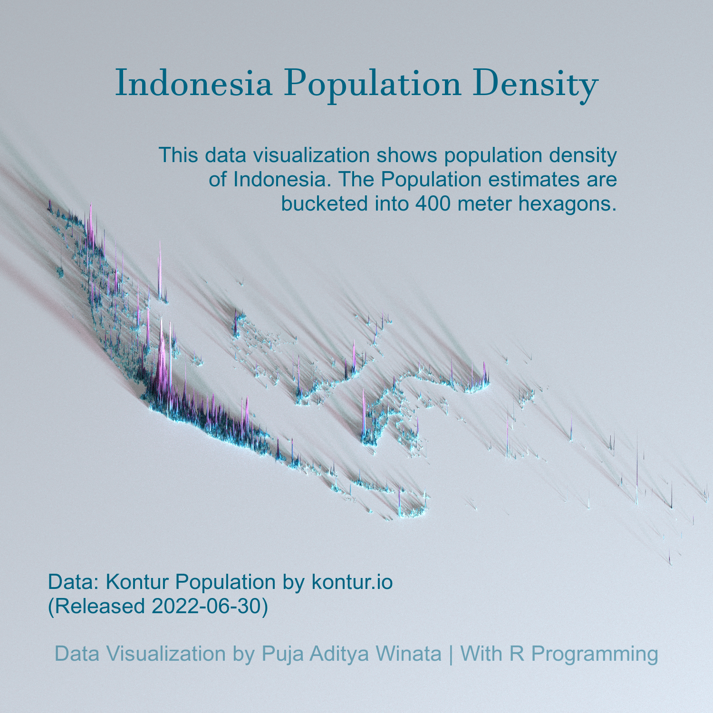
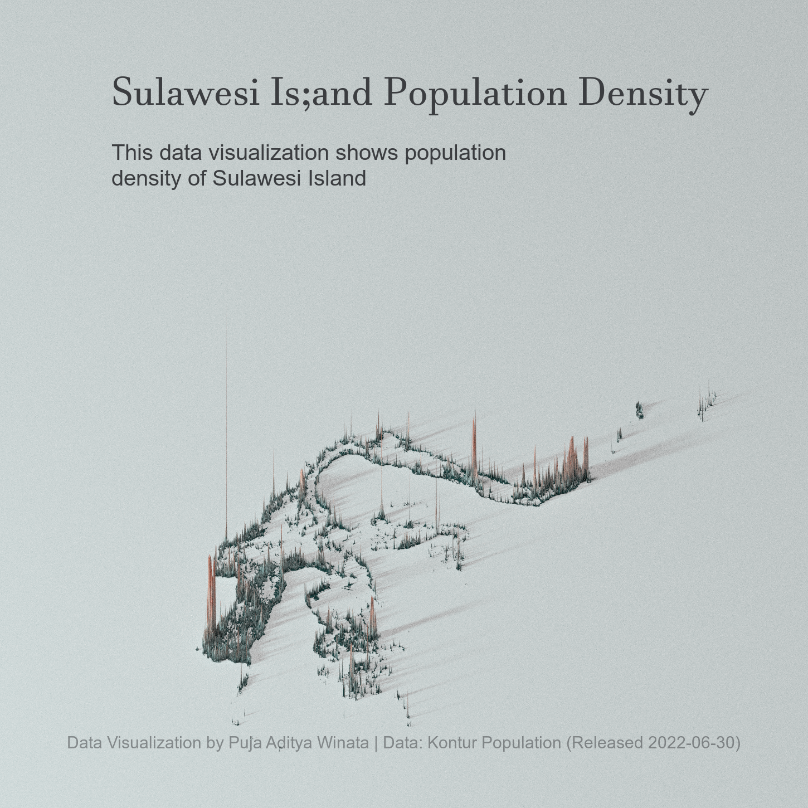

# Indonesia Data Visualization
This is repository about Indonesia's Density Population. This vizualisation was inspired by the amazing [Spencer Schein's Data Visualization](https://github.com/Pecners/rayshader_portraits/tree/main/R/portraits).
The data that i used is form Data Kontur Indonesia Density Population which released on May, 6th 2022 from [kontur.io](kontur.io).

The following are the results of the data visualization that I have made about population density in Indonesia and several other small areas.

## Indonesia Density Population

## Central Java Density Population

## Sulawesi Island Density Population

## Yogyakarta Density Population

## Semarang Density Population

